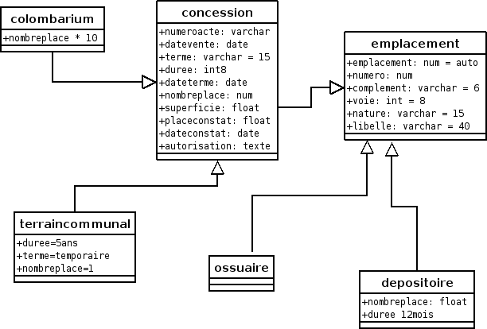

.. _principes:

#############
Elements UML
#############

Nous vous proposons dans ce chapitre quelques éléments d'uml.

On peut retrouver l'analyse UML complète au lien suivant :

http://www.openmairie.org/documentation/analyse-uml/opencimetiere/umlopencimetiere.pdf/view

Les cas d'utilisation d'openCimetière :
=======================================

.. image:: ../_static/casutilisation.png

Le diagramme de classe openCimetière
====================================

Le diagramme de classe permet de modéliser les classes et leurs relations
independamment d'un langage de programmation particulier.

Le diagramme des cas d utilisation montre le systeme du point de vue des acteurs.

Le diagramme de classe en montre la structure interne : representation abstraite qui vont
interagir ensemble pour réaliser les cas d utilisation.

.. image:: ../_static/uml_class.png

    
Diagramme de generalisation :

    

    
    

