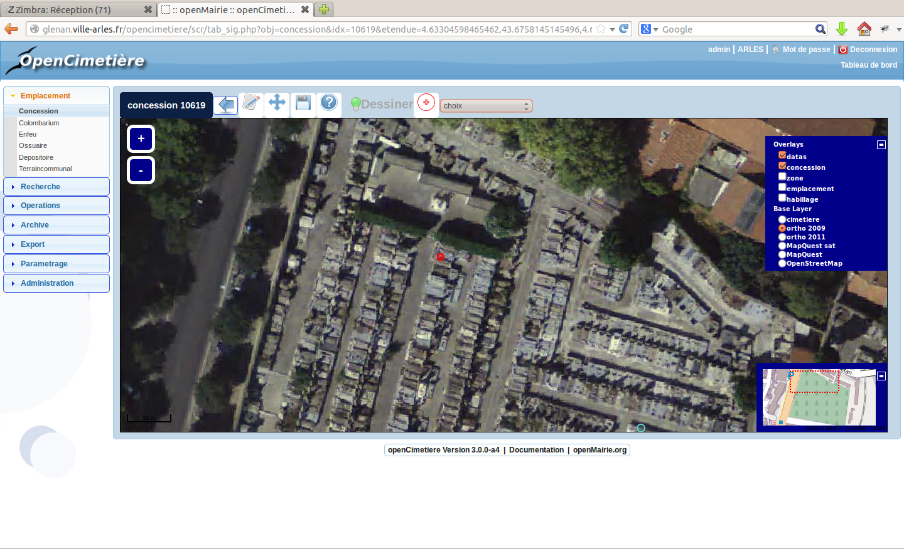

.. _geolocalisation:

##################
La géolocalisation
##################

Il est décrit ici les principes d'integration dans un SIG :

- la géolocalisation de l'emplacement

- l'utilisation de vues pour se connecter sur des bases externes

- la mise en place de lien sur un sig externe

=========================================
La geolocalisation automatique du dossier
=========================================

La géolocalisation se fait :

- pour les emplacements par un point

- pour les cimetieres et les zones, par un polygone

- pour les voies, par une ligne

Après avoir saisie l'emplacement, utilisez l'interface openLayers :

Affichage avec openLayers

Vous avez le détail de fonctionnement de l'interface dans le guide du développeur openMairie
(Information géographique)

===============================
Les vues sur des bases externes
===============================

Il est possible avec postgresql et dblink d'utiliser une base de données externe
( voir installation et utilisation de dblink dans le guide du développeur openMairie)

Ces vues se substitue alors aux tables de base et elles ne sont pas modifiables.
Elles doivent être déclarées dans dyn/var.inc ::

    $vue_cimetiere = 1; 
    $vue_zone=1;
    $vue_voie=1;

    1= vue active
    0= vue non active
    
===========================================
La mise en place de lien sur un SIG externe
===========================================

Il est possible de parametrer des liens sur un web sig externe.

Dans dyn/var.inc, exemple pour un accès à dynmap  ::

    /**
     * SIG externe 
     *
     /
    // Activer la fonctionnalite lien sig externe
    $option_externesig = 1;
    // Mettre 1 pour utiliser l'id de l'emplacement
    // Mettre 0 pour utiliser l'id renseigne dans le formulaire de la concession (id sig externe)
    $option_utiliseridemplacement = 1;
    // lien (url) du sig
    $lien_externesig = "http://.....IdValue=";

