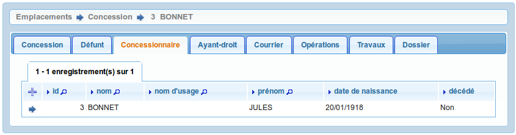
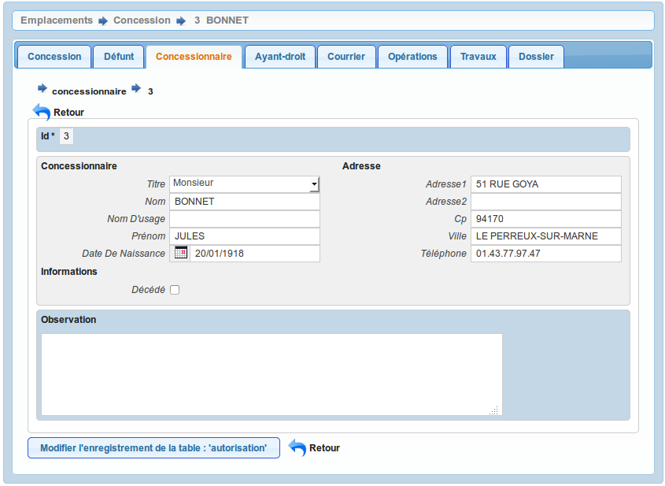

.. _autorisation:

###################################################
Les autorisations (concessionaires et ayants droit)
###################################################

Il est proposé de décrire dans ce paragraphe la saisie des autorisations
dans l'onglet "concessionnaire" ou "ayant-droit" de l'emplacement.

Concessionaire
##############

On accède à cet élément depuis l'onglet "Concessionnaire" de l'emplacement.
Tous les concessionaires liés à l'emplacement sont listés dans cet onglet.

Le formulaire est identique en mode ajout et modification.

Les informations à saisir sont :

- le titre (:ref:`titre_de_civilite`)
- le nom
- le prénon
- le nom d'usage

Ayant-droit
###########

On accède à cet élément depuis l'onglet "Ayant-droit" de l'emplacement.
Tous les ayants-droit liés à l'emplacement sont listés dans cet onglet.

Le formulaire est identique à ce lui du concessionnaire avec une information
supplémentaire : le lien de parenté.

