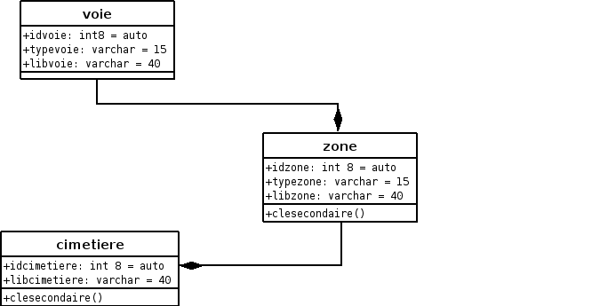

.. _cimetiere:

###################
Saisir un cimetiere
###################

Il est proposé de décrire dans ce paragraphe de decrire la saisie des lettres type
dans le menu paramétrage.

.. image:: ../_static/tab_cimetiere.png

Il est possible de géolocaliser le périmètre du cimetiere :

.. image:: ../_static/sig_cimetiere.png

Il est possible de creer ou modifier un cimetiere dans le formulaire ci dessous

.. image:: ../_static/form_cimetiere.png

Il est saisie :

- le destinataire le nom du cimetiere

Diagrame UML de classe pour la localisation :

