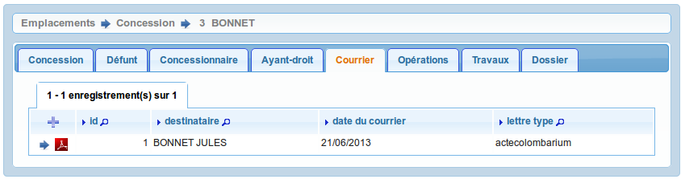
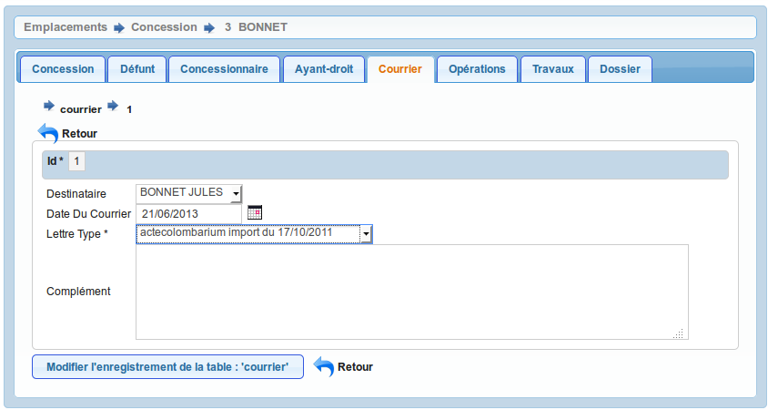

.. _courrier:

#############
Les courriers
#############

Il est proposé de décrire dans ce paragraphe la saisie de courrier dans l'onglet
"courrier" de l'emplacement.

On accède à cet élément depuis l'onglet "Courrier" de l'emplacement.
Tous les courriers liés à l'emplacement sont listés dans cet onglet.

Le formulaire est identique en mode ajout et modification.

Les informations à saisir sont :

- le destinataire (concessionnaire ou ayant droit)
- la date d envoi (par défaut la date du jour)
- la lettre type (le courrier type à envoyer)
- le complément : texte inséré dans la lettre type (suivant le paramétrage)

