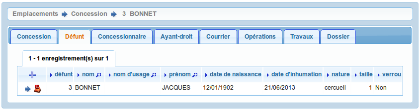
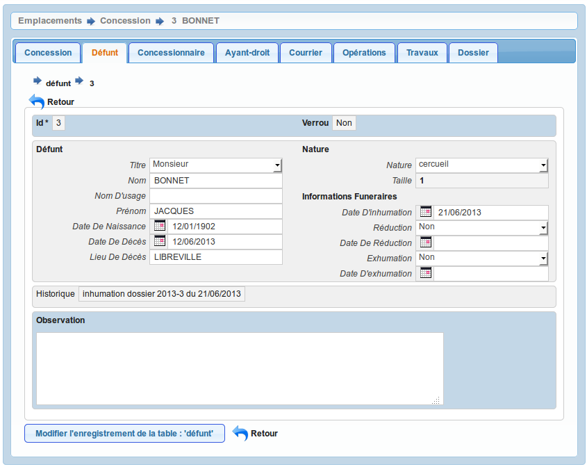

.. _defunt:

###########
Les défunts
###########

Il est proposé de décrire dans ce paragraphela saisie des défunts dans l'onglet
"défunt" d'un emplacement.

On accède à cet élément depuis l'onglet "Défunt" de l'emplacement.
Tous les courriers liés à l'emplacement sont listés dans cet onglet.

Saisir un défunt
----------------

Le formulaire est identique en mode ajout et modification.

Les informations à saisir sont :

- le titre (:ref:`titre_de_civilite`)
- le nom du défunt (obligatoire)
- le prénon
- le nom d'usage
- la date de naissance
- la date de décés
- le lieu du décès
- la date d'inhumation
- les opérations funéraires : exhumation, inhumation

Calcul de l'occupation
----------------------

Le calcul de la taille d'occupation se fait à partir des paramères suivants :

- taille_cercueil : valeur par défaut 1 (:ref:`paramétrage général <taille_cercueil>`)
- taille_urne : valeur par défaut 0,1 (:ref:`paramétrage général <taille_urne>`)
- taille_reduction : valeur par défaut 0,5 (:ref:`paramétrage général <taille_reduction>`)
- temps_reduction : valeur par défaut 5 (:ref:`paramétrage général <temps_reduction>`)
    
C'est sur cette base que se fait le calcul de la taille et le calcul de place
dans l'emplacement.

