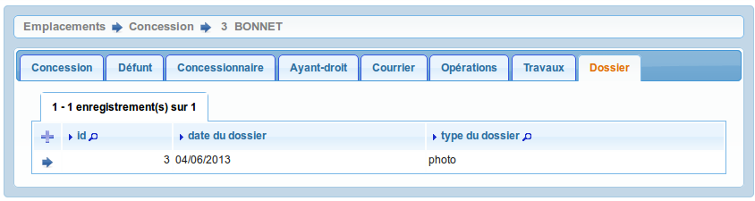
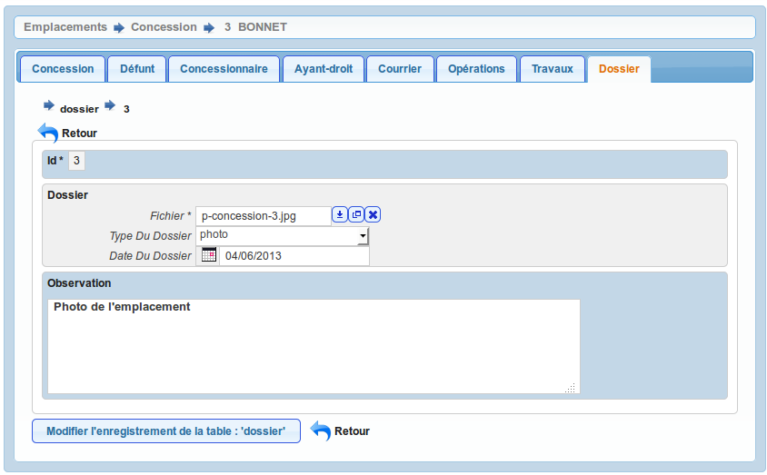
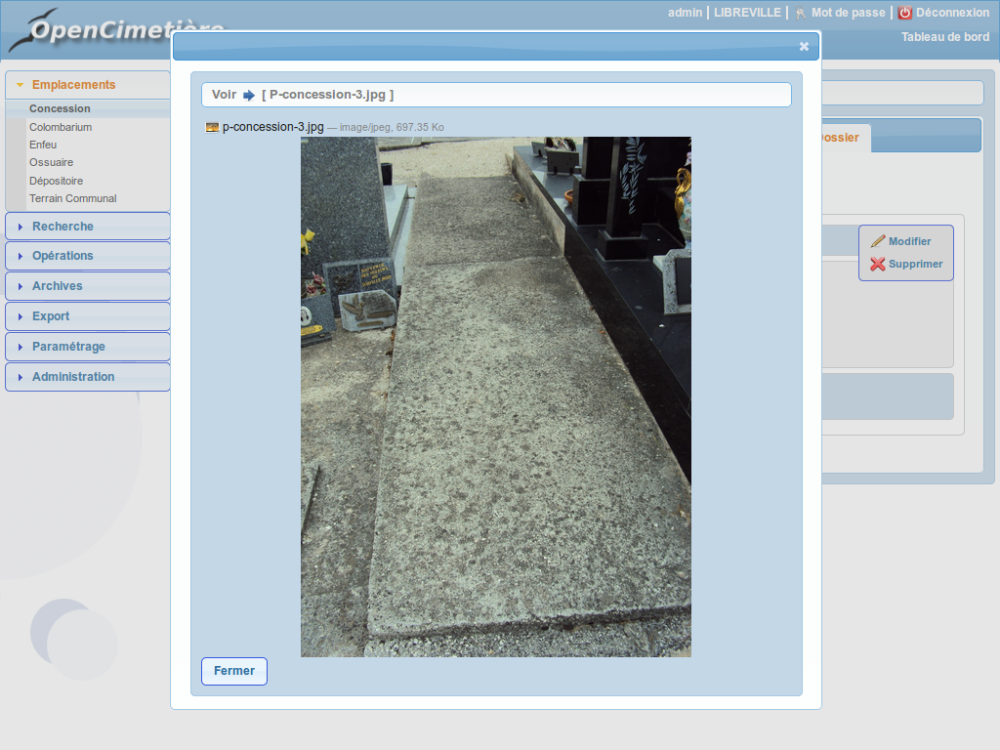

.. _dossier:

##################################
Les dossiers (photos ou documents)
##################################

Il est proposé de décrire dans ce paragraphe l'upload de document dans les
dossiers dans l'onglet "dossier" de l'emplacement.

On accède à cet élément depuis l'onglet "Dossier" de l'emplacement.
Tous les courriers liés à l'emplacement sont listés dans cet onglet.

Le formulaire est identique en mode ajout et modification.

En mode visualisation il est possible de visualiser le fichier en cliquant sur
le lien "Visualiser" ou "Télécharger".

Les informations à saisir sont :

- le fichier à télécharger (obligatoire)
- la date 
- le type de document: photo ou dossier (pdf)
- une observation

