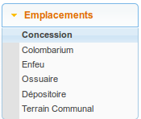
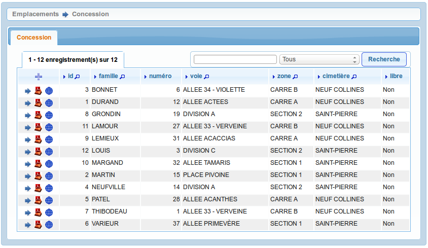
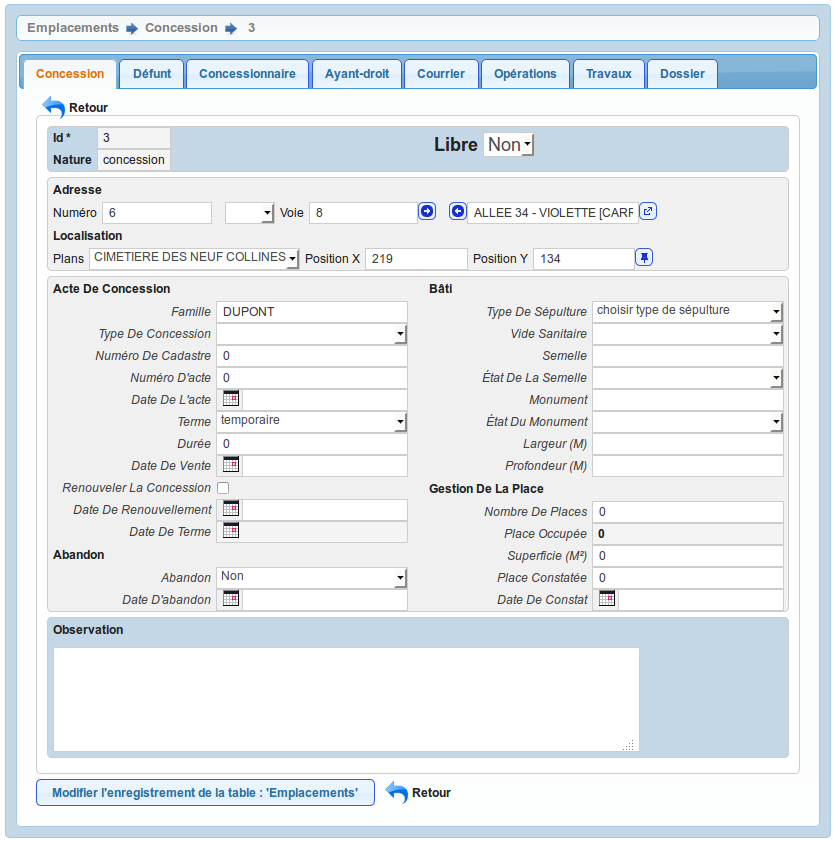
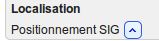
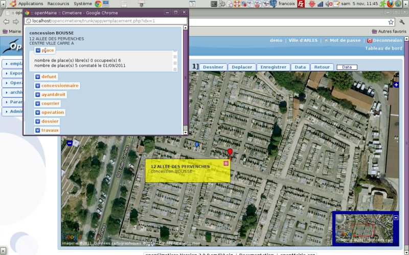

.. _emplacement:

################
Les emplacements
################

Il existe six types d'emplacements différents dans l'applicatif :

* :ref:`concession`,
* :ref:`colombarium`,
* :ref:`enfeu`,
* :ref:`ossuaire`,
* :ref:`depositoire`,
* :ref:`terraincommunal`.

On accède à ces différents emplacements depuis le menu
(:menuselection:`Emplacements`).

Seul le type d'emplacement concession est décrit ici car c'est le plus
exhaustif. Les autres types possèdent moins d'éléments.

.. _concession:

La concession
=============

Cet élément est accessible via (:menuselection:`Emplacements --> Concession`).

La concession est une place dans un cimetière.
http://fr.wiktionary.org/wiki/concession

Le formulaire est identique en mode ajout et modification.

Les informations à saisir sont :

* numéro dans la voie
* voie
* famille

.. _colombarium:

Le colombarium
==============

Cet élément est accessible via (:menuselection:`Emplacements --> Colombarium`).

Aussi appelé columbarium, le colombarium est un édifice destiné à recevoir des
urnes mortuaires dans les cimetières où l’on pratique l’incinération.
http://fr.wiktionary.org/wiki/columbarium

.. _enfeu:

L'enfeu
=======

Cet élément est accessible via (:menuselection:`Emplacements --> Enfeu`).

L'enfeu est une niche dans un édifice religieux abritant un tombeau, un
sarcophage ou une scène funéraire.
http://fr.wiktionary.org/wiki/enfeu

.. _ossuaire:

L'ossuaire
==========

Cet élément est accessible via (:menuselection:`Emplacements --> Ossuaire`).

L'ossuaire est un endroit couvert où l’on met des ossements humains.
http://fr.wiktionary.org/wiki/ossuaire

.. _depositoire:

Le dépositoire
==============

Cet élément est accessible via (:menuselection:`Emplacements --> Dépositoire`).

Le dépositoire est le nom donné, dans quelques localités, au lieu où l’on dépose
les corps des morts, avant de les enterrer, et jusqu’à ce que la décomposition
putride commence à se manifester.
http://fr.wiktionary.org/wiki/d%C3%A9positoire

.. _terraincommunal:

Le terrain communal
===================

Cet élément est accessible via
(:menuselection:`Emplacements --> Terrain Communal`).

Appelé aussi "terrain commun", le terrain communal est ...

Deux valeurs sont présentes par défaut au chargement du formulaire :

- superficie_terraincommunal : valeur par défaut 2 (:ref:`paramétrage général <superficie_terraincommunal>`)
- duree_terraincommunal : valeur par défaut 5 (:ref:`paramétrage général <duree_terraincommunal>`)

################################
La localisation de l'emplacement
################################

Option Plan
===========

La localisation d'un emplacement sur un plan possède deux modes :

* le positionnement de l'emplacement : depuis le formulaire de modification de
  l'emplacement, il est possible de cliquer sur l'action "Positionner l'élément"
  pour obtenir un écran de positionnement sur le plan.

  .. image:: opencimetiere--geolocalisation-plan-modifier-emplacement.png
  
  Au clic sur la punaise, une fenêtre s'ouvre avec le plan et l'emplacement
  positionné en fonction des coordonnées X et Y présentes dans les champs. Il
  suffit de déplacer le point bleu avec la souris pour le positionner à
  l'endroit souhaité. Un double clic sur ce point bleu fermera le plan et
  positionnera les nouvelles coordonnées dans le formulaire. Il faut enregistrer
  le formulaire de l'emplacement pour que les modifications soient prises en
  compte.

* la visualisation de l'emplacement : depuis le tableau ou depuis le formulaire
  en mode visualisation, il est possible de cliquer sur l'action "Visualiser sur
  plan" pour voir le positionnement de l'emplacement sur le plan.

  .. image:: opencimetiere--geolocalisation-plan-visualiser-emplacement.png

Option SIG
==========

SIG interne
-----------

Il est possible de géolocaliser l'emplacement :

Il est possible d'accéder dans la barre de l'interface au choix du cimetiere
(paramétrage dans dyn/tab_sig_barre.inc.php)

