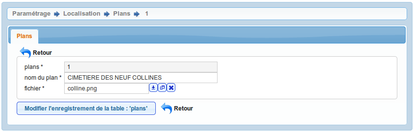

.. _geolocalisation:

##################
La géolocalisation
##################

La géolocalisation est un procédé permettant de positionner un objet (une
personne, un bâtiment, ...) sur un plan ou une carte à l'aide de ses coordonnées
géographiques.

Dans cet applicatif, il existe trois possibilités pour géolocaliser les
emplacements. C'est le paramètre "option_localisation"
(:ref:`paramétrage général <option_localisation>`) qui doit être positionné
sur une des options disponibles :

- :ref:`plans`,
- :ref:`option_sig_interne`,

.. _plans:

Option Plan
===========

Un plan correspond à un croquis d'un cimetière ou d'une partie d'un cimetière.
Un emplacement se localise sur un plan grâce à un point.

.. note::

    Cette option est conservée pour des raisons de compatibilité avec
    l'ancienne version mais il est important de signaler qu'elle ne
    constitue pas un véritable système de géolocalisation même si elle apparait
    comme simple et pratique.

Cet élément est accessible via 
(:menuselection:`Paramétrage --> Localisation --> Plans`).

Saisir un plan
--------------

Il est possible de créer ou modifier un plan dans le formulaire ci-dessous :

Les informations à saisir sont :

- le fichier à télécharger
- le libéllé du plan

Visualiser un plan
------------------

|icone-localiser|

Cette action permet de visualiser le plan avec tous les emplacements
positionnés sur ce dernier. Au survol d'un emplacement, le nom de famille de
l'emplacement apparaît et en cliquant sur le point on accède à la fiche de
l'emplacement en visualisation.

Code couleur des points :

* Un point jaune représente un emplacement temporaire.
* Un point vert représente un emplacement libre.
* Un point rouge représente un emplacement à perpétuité.

.. _option_sig:

Option SIG
==========

.. _option_sig_interne:

SIG interne
-----------

Dans le menu, option administration, il est possible de paramétrer les cartes (om_sig_map) et de
paramétrer les liens wms (om_sig_wms) si l'option sig_interne est choisie.
(voir le guide du développeur openMairie)

.. |icone-localiser| image:: opencimetiere--icone-localiser.png
