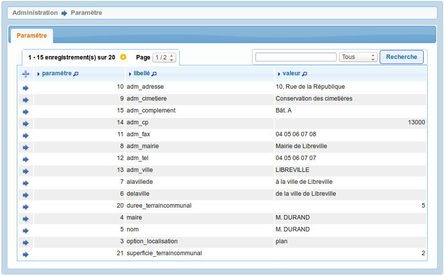

.. _parametres_generaux:

###################
Paramètres généraux
###################

Cet élément est accessible via 
:menuselection:`Administration --> Paramètre`.

.. _option_localisation:

Système de géolocalisation
--------------------------

"option_localisation" :

- plan
- sig_interne
- sig_externe

.. _taille_cercueil:

Taille d'un cercueil
--------------------

"taille_cercueil"

.. _taille_reduction:

Taille de la réduction
----------------------

"taille_reduction"

.. _taille_urne:

Taille d'une urne
-----------------

"taille_urne"

.. _temps_reduction:

Temps obligatoire avant la réduction
------------------------------------

"temps_reduction"

.. _duree_terraincommunal:

Durée par défaut pour un terrain communal
-----------------------------------------

"duree_terraincommunal"

.. _superficie_terraincommunal:

Superficie par défaut pour un terrain communal
----------------------------------------------

"superficie_terraincommunal"

