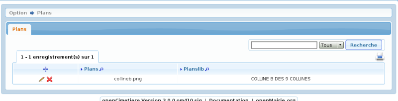
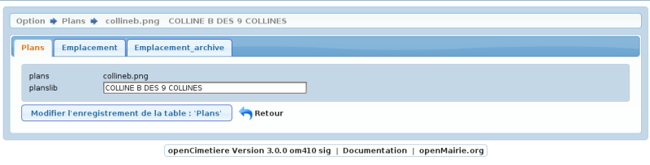

.. _plans:

###############
Saisir un plans
###############

Il est proposé de décrire dans ce paragraphe de decrire la saisie des
plans dans le menu paramètrage

Le plans correspond à l'option "croquis" de l'emplacement qui permet de
positionner un point sur un plan dans emplacement.class.php

Les plans sont listés dans le formulaire suivant

Il est possible de creer ou modifier un plans dans le formulaire ci dessous

Il est saisie :

- le fichier à telecharger

- le libéllé du plan

Il est possible de désactiver l'option avec $croquis = 0 dans var.inc

<avertissement>

Cette option est conservée pour des raisons de compatibilité avec
l'ancienne version mais il est important de signaler qu'elle ne
constitue pas une véritable géo localisation même si elle apparait
comme simple et pratique

</avertissement>
