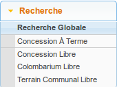
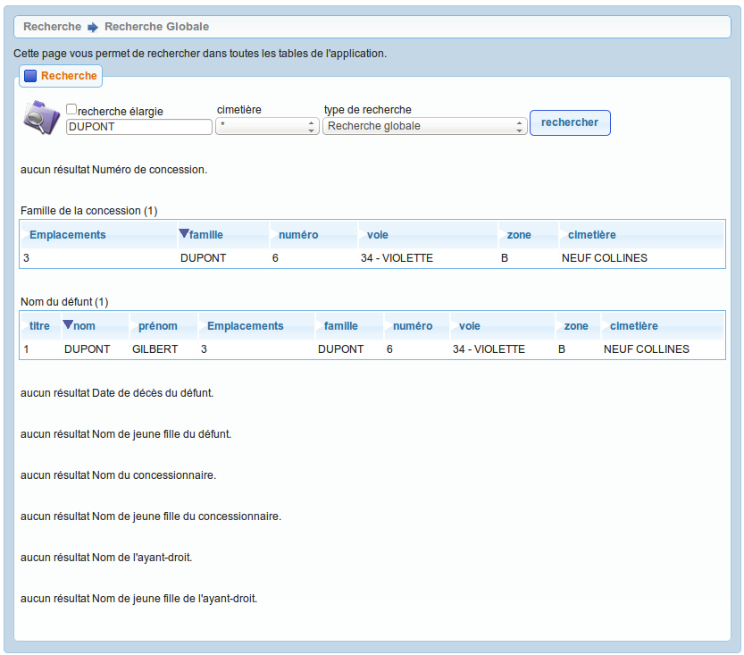

.. _recherche:

#########
Recherche
#########

La rubrique Recherche permet de rechercher des emplacements, des défunts ou
des autorisations selon différents critères. Ce sont ces différents outils de
recherche que nous allons décrire ici.

.. _recherche_globale:

La recherche globale
####################

Cet élément est accessible via 
(:menuselection:`Recherche --> Recherche globale`) ainsi que directement
depuis le tableau de bord :ref:`widget_recherche_globale`.

La recherche globale a pour but de retrouver tous les enregistrements
d'openCimetière liés à un nom dans les tables de l application avec :

* possibilité d'étendre la recherche sur une partie de mot (recherche élagie
  cochée)
* possibilité de restreindre la recherche a un cimetière
* possibilité de restreindre la recherche a un champ en particulier

Les résultats sont affichés par type d'élément. Le tri sur les colonnes des
tableaux résultats permettent de trier les résultats. Il suffit de cliquer
sur un élément de tableau pour accéder à l'emplacement en question.

.. _concession_a_terme:

Concession à terme
##################

Cet élément est accessible via 
(:menuselection:`Recherche --> Concession à terme`) ainsi que directement
depuis le tableau de bord :ref:`widget_concession_a_terme`.

Cet écran liste les emplacements de type concession qui ont une date de terme
dans le passé.

.. _concession_libre:

Concession libre
################

Cet élément est accessible via 
(:menuselection:`Recherche --> Concession libre`).

Cet écran liste les emplacements de type concession qui sont notés comme libres.

.. _colombarium_libre:

Colombarium libre
#################

Cet élément est accessible via 
(:menuselection:`Recherche --> Colombarium libre`).

Cet écran liste les emplacements de type colombarium qui sont notés comme
libres.

.. _terraincommunal_libre:

Terrain Communal libre
######################

Cet élément est accessible via 
(:menuselection:`Recherche --> Terrain Communal libre`).

Cet écran liste les emplacements de type terrain communal qui sont notés comme
libres.
