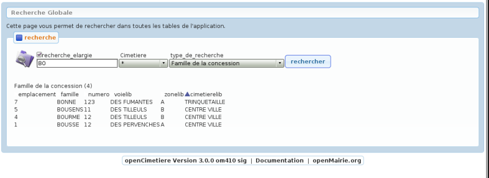

.. _recherche:

#########
Recherche
#########

La rubrique Recherche permet de recherher des emplacements, des défunts ou
des autorisations selon différents critères. Ce sont ces différents outils de
recherche que nous allons décrire ici.

.. image:: opencimetiere--menu-recherche.png

.. _recherche_globale:

La recherche globale
####################

La recherche globale a pour but de retrouver tous les enregistrements
d'openCimetière lié à un nom dans les tables de l application avec :

- possibilité d'étendre la recherche sur une partie de mot (recherche élagie cochée)

- possibilité de restreindre la recherche a un cimetière

- possibilité de restreindre la recherche a un champ

