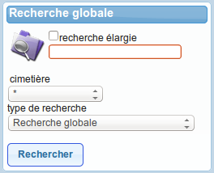
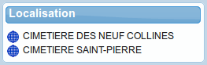

.. _tableau_de_bord:

##################
Le tableau de bord
##################

Le tableau de bord permet simplement de présenter des raccourcis et des
informations vers les actions les plus fréquemment utilisées dans l'applicatif.
Il est généralement composé de trois colonnes et de différents widgets (bloc
d'informations). En fonction du profil de l'utilisateur, certains widgets
peuvent ne pas être affichés.

.. image:: opencimetiere--tableau-de-bord.png

.. _widget_recherche_globale:

Le widget Recherche globale
###########################

Cet widget a pour objectif de permettre d'effecteur une recherche directement
depuis le tableau de bord. Les critères de recherche sont identiques à ceux de
l'écran :ref:`recherche_globale`. C'est d'ailleurs sur cet écran que les
résultats vont s'affichés lors de la validation du formulaire du widget.

.. _widget_localisation:

Le widget Localisation
######################

Ce widget a pour objectif de donner des accès rapides aux fonctions de
localisation en fonction de l'option de localisation paramétrée. Le paramètre
"option_localisation" (:ref:`paramétrage général <option_localisation>`) change
le contenu de ce widget.

Option Plan
===========

Si aucun plan n'est configuré alors le widget affiche un message prévenant
l'utilisateur qu'aucun plan n'est configuré.

Si au moins un plan est configuré alors ce widget affiche la liste des plans
avec un lien vers l'action "Visualiser un plan" (Voir :ref:`plans`).

Option SIG
==========

SIG interne
-----------

Pour l'instant, aucune information n'est présente dans le widget si c'est cette
option qui est activée.

SIG externe
-----------

Pour l'instant, aucune information n'est présente dans le widget si c'est cette
option qui est activée.

.. _widget_supervision:

Le widget Supervision
#####################

L'objectif de ce widget est de présenter le nombre d'emplacements par type et
par cimetière dans l'applicatif.

.. _widget_concession_a_terme:

Le widget Concession à terme
############################

Ce widget a pour objectif d'afficher les quinze concessions à terme et de donner
un accès direct à l'écran :ref:`concession_a_terme`. En effet, tous les liens
présents dans ce widget redirigent vers cet écran.

