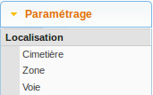
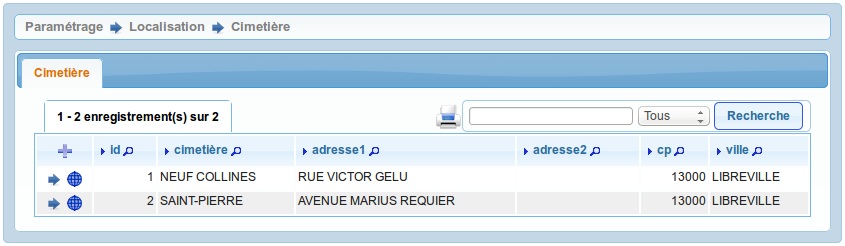
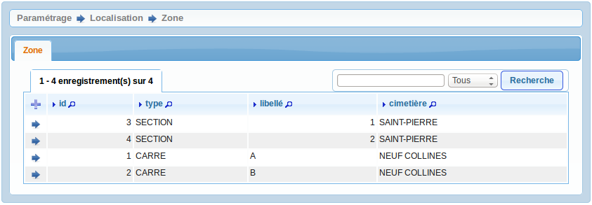
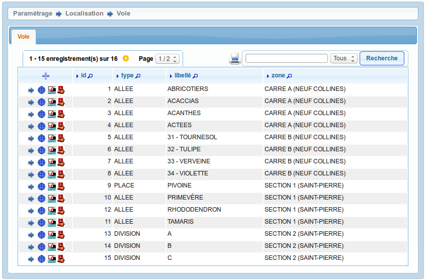

.. _tables_de_localisation:

##########################
Les tables de localisation
##########################

La localisation permet de donner une adresse précise à un emplacement. Cette
localisation est divisée en plusieurs niveaux. D'abord le cimetière qui peut 
contenir plusieurs zones. Puis chaque zone peut contenir plusieurs voies.
Enfin dans une voie l'emplacement est identifié par un numéro.

Nous allons décrire dans ce paragraphe comment paramétrer les tables de
localisation qui composent la localisation d'un emplacement :

* le cimetière,
* la zone,
* la voie.

Le paramétrage de ces éléments se fait dans le menu
(:menuselection:`Paramétrage --> Localisation`).

.. _cimetiere:

Le cimetière
============

Cet élément est accessible via 
(:menuselection:`Paramétrage --> Localisation --> Cimetière`).

Depuis ce listing trois éditions sont disponibles :

* |icone-edition-pdf| : listing PDF des cimetières
* |icone-edition-pdfetat-voie| : ...
* |icone-edition-pdfetat-voieconcession| : ...

Saisir un cimetière
-------------------

Il est possible de créer ou modifier un cimetière dans le formulaire ci dessous

.. image:: ../_static/form_cimetiere.png

Les informations à saisir sont :

- le libellé
- l'adresse (sur deux lignes)
- le code postal
- la ville
- des observations

Modifier un cimetière
---------------------

Toutes les informations du cimetière sauf son identifiant sont modifiables.

Localiser un cimetière (option SIG)
-----------------------------------

Il est possible de géolocaliser le périmètre du cimetière :

.. image:: ../_static/sig_cimetiere.png

.. _zone:

La zone
=======

Cet élément est accessible via 
(:menuselection:`Paramétrage --> Localisation --> Zone`).

Saisir une zone
---------------

Il est possible de creer ou modifier une zone dans le formulaire ci dessous

.. image:: ../_static/form_zone.png

Les informations à saisir sont :

- le cimetière dans lequel se trouve la zone
- le type de zone (:ref:`zone_type`)
- le libellé de la zone

.. tip::

    Il est possible de saisir une zone depuis l'onglet zone du formulaire d'un
    cimetière. Cela permet d'éviter d'avoir à sélectionner le cimetière concerné
    à chaque ajout de zone.

Localiser une zone (option SIG)
-------------------------------

Il est possible de géolocaliser le périmètre d'une zone :

.. image:: ../_static/sig_zone.png

.. _voie:

La voie
=======

Cet élément est accessible via 
(:menuselection:`Paramétrage --> Localisation --> Voie`).

Saisir une voie
---------------

Il est possible de creer ou modifier une voie dans le formulaire ci dessous

.. image:: ../_static/form_voie.png

Les informations à saisir sont :

- le zone dans laquelle se trouve la voie
- le type de voie (:ref:`voie_type`)
- le libellé de la voie

.. tip::

    Il est possible de saisir une voie depuis l'onglet voie du formulaire d'une
    zone. Cela permet d'éviter d'avoir à sélectionner la zone concernée à chaque
    ajout de voie.

Localiser une voie (option SIG)
-------------------------------

Il est possible de géolocaliser la ligne d'une voie :

.. image:: ../_static/sig_voie.png

