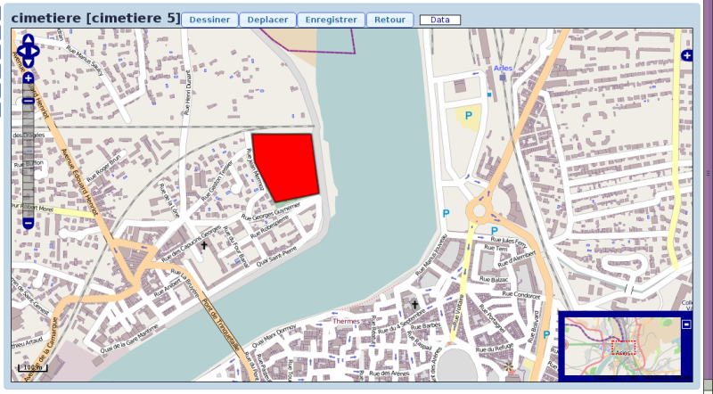

.. _tables_de_localisation:

##########################
Les tables de localisation
##########################

.. _cimetiere:

Le cimetière
============

Cet élément est accessible via 
:menuselection:`Paramétrage --> Localisation --> Cimetière`.

.. image:: ../_static/tab_cimetiere.png

Saisir un cimetière
-------------------

Il est possible de créer ou modifier un cimetière dans le formulaire ci dessous

.. image:: ../_static/form_cimetiere.png

Les informations à saisir sont :

- le libellé
- l'adresse (sur deux lignes)
- le code postal
- la ville
- des observations

Modifier un cimetière
---------------------

Toutes les informations du cimetière sauf son identifiant sont modifiables.

Localiser un cimetière (option SIG)
-----------------------------------

Il est possible de géolocaliser le périmètre du cimetière :

.. _zone:

La zone
=======

Cet élément est accessible via 
:menuselection:`Paramétrage --> Localisation --> Zone`.

.. image:: ../_static/tab_zone.png

Saisir une zone
---------------

Il est possible de creer ou modifier une zone dans le formulaire ci dessous

.. image:: ../_static/form_zone.png

Les informations à saisir sont :

- le cimetière dans lequel se trouve la zone
- le type de zone
- le libellé de la zone

.. admonition:: XXX

    Le type de la zone peut être modifié dans dyn/var.inc ::

        $select_zone=array('CARRE',
                           'COLLINE',
                           'ENCLOS',
                           'EXTENSION',
                           'SECTION');

.. tip::

    Il est possible de saisir une zone depuis l'onglet zone du formulaire d'un
    cimetière. Cela permet d'éviter d'avoir à sélectionner le cimetière concerné
    à chaque ajout de zone.

Localiser une zone (option SIG)
-------------------------------

Il est possible de géolocaliser le périmètre d'une zone :

.. image:: ../_static/sig_zone.png

.. _voie:

La voie
=======

Cet élément est accessible via 
:menuselection:`Paramétrage --> Localisation --> Voie`

.. image:: ../_static/tab_voie.png

Saisir une voie
---------------

Il est possible de creer ou modifier une voie dans le formulaire ci dessous

.. image:: ../_static/form_voie.png

Les informations à saisir sont :

- le zone dans laquelle se trouve la voie
- le type de voie
- le libellé de la voie

.. admonition:: XXX

    Le type de la voie peut être modifié dans dyn/var.inc ::

        $select_voie=array('ALLEE',
                           'ILOT',
                           'PLACE',
                           'PASSAGE',
                           'RANGEE',
                           'DIVISION');

.. tip::

    Il est possible de saisir une voie depuis l'onglet voie du formulaire d'une
    zone. Cela permet d'éviter d'avoir à sélectionner la zone concernée à chaque
    ajout de voie.

Localiser une voie (option SIG)
-------------------------------

Il est possible de géolocaliser la ligne d'une voie :

.. image:: ../_static/sig_voie.png

