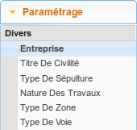
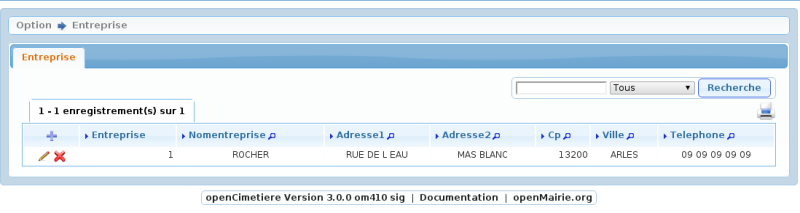
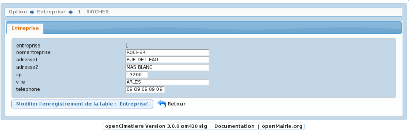

.. _tables_de_reference:

#######################
Les tables de référence
#######################

Une table de référence (ou de codification) permet de limiter volontairement
les valeurs possibles pour une information saisie. Cela évite que cette valeur
ne soit décrite de deux manières différentes.

Dans ce logiciel, les tables de référence sont composées d'un identifiant, d'un
libellé et de dates de validité.

La date de validité permet de contrôler les éléments qui apparaissent dans les
listes à choix des formulaires. Si la date de fin de validité est dépassée alors
cet élément n'est plus sélectionnable comme référence cependant il reste
sélectionné là où il l'a déjà été.

.. _entreprise:

L'entreprise
============

Cette table est référencée par le(s) élément(s) suivant(s) :

* :ref:`travaux`.

Cet élément est accessible via 
:menuselection:`Paramétrage --> Divers --> Entreprise`.

Saisir une entreprise
---------------------

Il est possible de créer ou modifier une entreprise via le formulaire ci-dessous

        

Les informations à saisir sont :

- le nom de l'entreprise (obligatoire)
- s'il s'agit d'une entreprise de pompe funèbre
- l'adresse (sur deux lignes)
- le code postal
- la ville
- le téléphone

.. _titre_de_civilite:

Le titre de civilité
====================

Cet élément est accessible via 
:menuselection:`Paramétrage --> Divers --> Titre de civilité`.

Le titre de civilité est le plus fréquemment utilisé pour identifier la civilité
d'une personne (Monsieur, Madame ou Mademoiselle). Il est également utilisé
pour le titre ou le rang d'une personne.

Cette table est référencée par le(s) élément(s) suivant(s) :

* :ref:`defunt`,
* :ref:`autorisation`.

.. _sepulture_type:

Le type de sépulture
====================

Cet élément est accessible via 
:menuselection:`Paramétrage --> Divers --> Type de sépulture`.

Le type de sépulture est utilisé pour décrire une concession. Exemples :
'Fosse maçonnée haute', 'Cavurne', 'Pierre tombale', 'Caveau T2 haut',
'Caveau T2 bas', ...

Cette table est référencée par le(s) élément(s) suivant(s) :

* :ref:`concession`.

.. _travaux_nature:

La nature des travaux
=====================

Cet élément est accessible via 
:menuselection:`Paramétrage --> Divers --> Nature des travaux`.

La nature des travaux est utilisée pour décrire les travaux sur un emplacement.
Exemples : 'Enlèvement porte', 'Démolition-Reconstruction à l'identique',
'Creusement', 'Surélévation', ...

Cette table est référencée par le(s) élément(s) suivant(s) :

* :ref:`travaux`.

.. _zone_type:

Le type de zone
===============

...

* :ref:`zone`.

.. _voie_type:

Le type de voie
===============

...

* :ref:`voie`.

