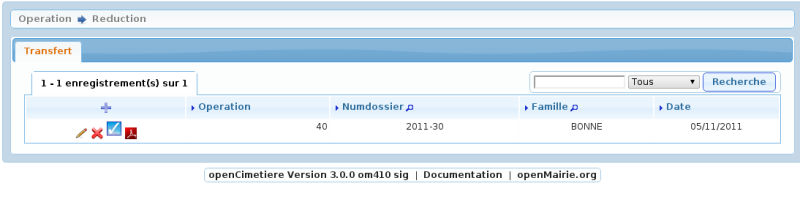
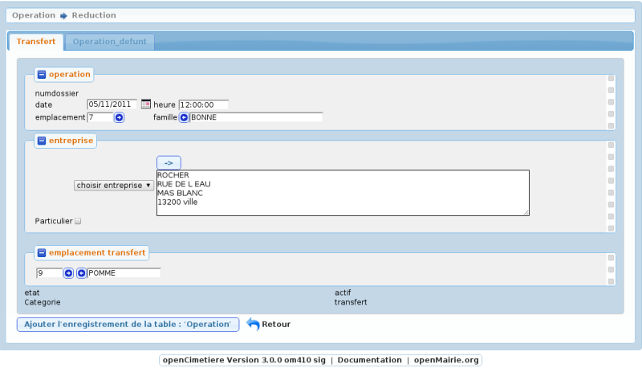
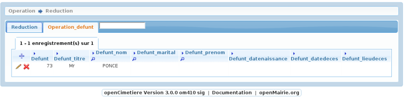
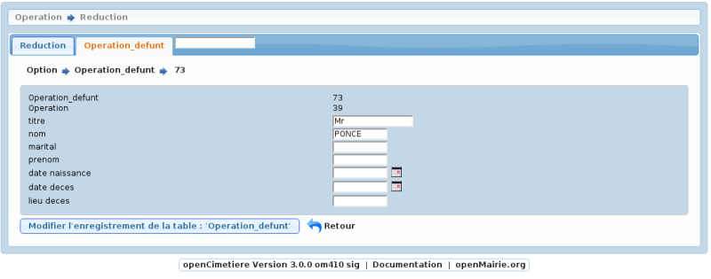
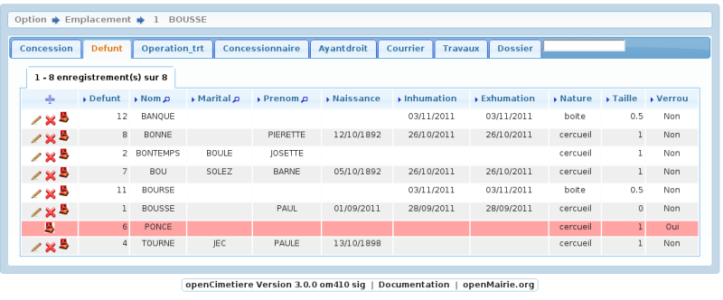

.. _transfert:

###################
Saisir un transfert
###################

Il est proposé de décrire dans ce paragraphe de decrire la saisie d'un transfert
dans le module operation

Choisir l'option transfert emplacement

Il est possible de creer ou modifier l'opération dans le formulaire ci dessous

Il est saisie :

- la date et heure de l'opération

- l'emplacement concerné

- l'entreprise effectuant le travail

- l'emplacement de transfert

Les défunts concernés sont saisis dans l'onglet operation_defunt

Ils doivent appartenir à l'emplacement de départ.

Mise à jour d'un defunt

Le defunt est alors verrouillé dans l'emplacement

