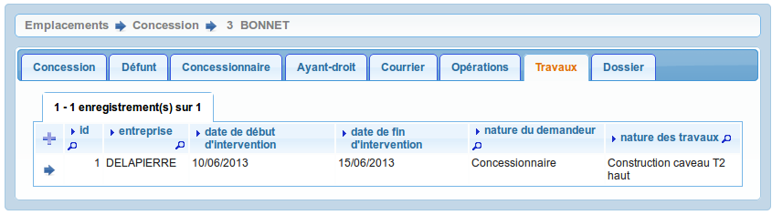

.. _travaux:

###########
Les travaux
###########

On accède à cet élément depuis l'onglet "Travaux" de l'emplacement.
Tous les travaux liés à l'emplacement sont listés dans cet onglet.

Le formulaire est identique en mode ajout et modification.

Les informations à saisir sont : 

- l'entreprise (:ref:`entreprise`)
- la date de début d'intervention
- la date de fin d'intervention
- la nature du demandeur : ("concesionnaire", "ayant droit" ou "autre")
- la nature des travaux (:ref:`travaux_nature`)

