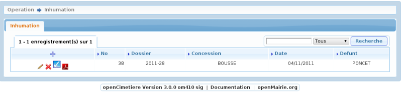
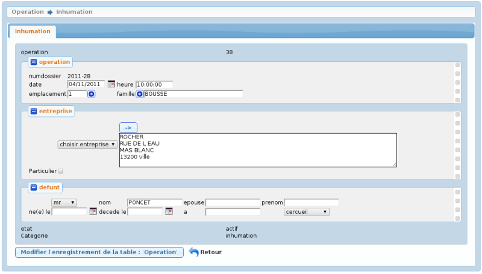

.. _inhumation:

#####################
Saisir une inhumation
#####################

Il est proposé de décrire dans ce paragraphe de decrire la saisie d'une inhumation
dans le module operation

Choisir l'option :

- inhumation concession

- inhumation colombarium

- inhumation terrain communal

- inhumation enfeu

Il est possible de creer ou modifier une opération dans le formulaire ci dessous

Il est saisie :

- la date et heure de l'opération

- l'emplacement concerné

- l'entreprise effectuant letravail

- le nom du défunt (et autres renseignements)

