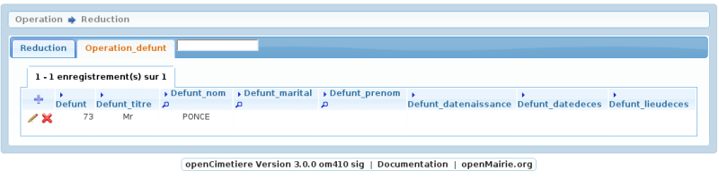
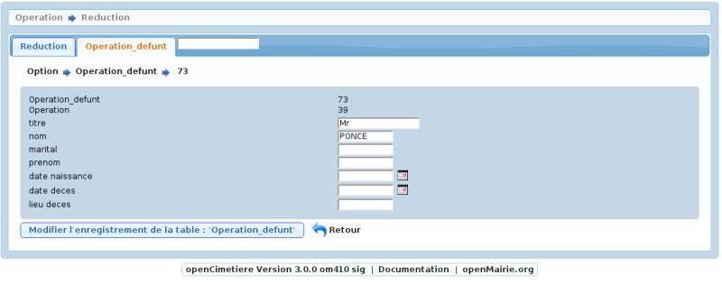
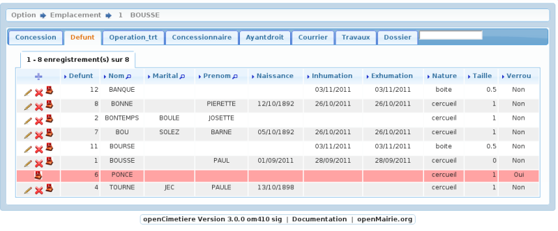

.. _reduction:

####################
Saisir une reduction
####################

Il est proposé de décrire dans ce paragraphe de decrire la saisie d'une reduction
dans le module operation

Choisir l'option :

- reduction concession

- reduction enfeu 

Il est possible de creer ou modifier une opération dans le formulaire ci dessous

Il est saisie :

- la date et heure de l'opération

- l'emplacement concerné

- l'entreprise effectuant le travail

Les défunts concernés sont saisis dans l'onglet operation_defunt

Ils doivent appartenir à l'emplacement considérée.

Mise à jour d'un defunt

Le defunt est alors verrouillé dans l'emplacement

