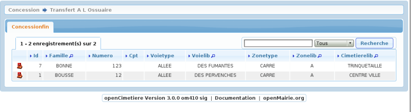
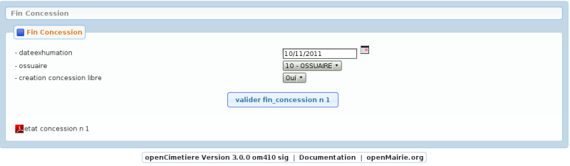

.. _archivage:

#################
Fin de concession
#################

menu->archive->fin de concession

Le traitement de fin de concession consiste à :

- terminer la concession

- transferer les defunts non exhumés à l'ossuaire

- conserver la trace des défunts exhumés dans defunt_archive

- transferer les courriers dans courrier_archive

- transferer les travaux dans travaux_archive

- transferer le dossier numerisé dans dossier_archive

- transferer les concessionnaires et ayant droit dans autorisation_archive

Ceci permet d'avoir la tracabilité des concessions.

Les opérations traitées ne sont pas affectées

Attention les opérations en cours doivent être traitées

Il est créé un emplacement vide reprenant tous les éléments de
localisation.

Ce traitement est valable pour :

- colombarium

- terrain communal

- enfeu

Le lancement du traitement se fait avec le formulaire suivant :

Il faut saisir ensuite l'ossuaire et la date

ATTENTION, le traitement est irreversible

=======
archive
=======

Les archives sont consultables dans l'option "archive" du menu

Elles ne sont pas modifiables
