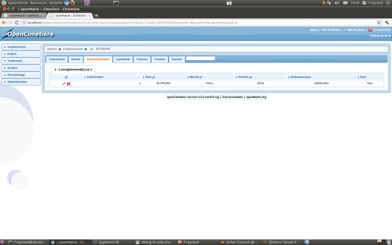
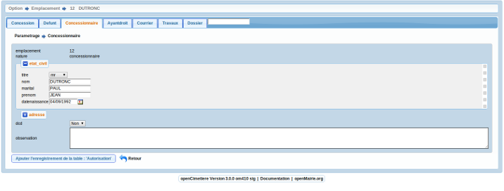
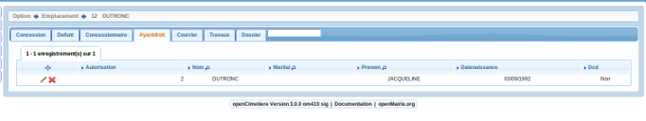
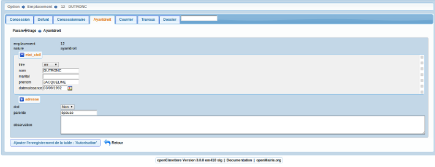

.. _autorisation:

#######################
Saisir une autorisation
#######################

Il est proposé de décrire dans ce paragraphe de decrire la saisie des autorisations
dans l'onglet "concessionnaire" ou "ayantdraoit" de l'emplacement.

Pour les concessionnaires

Il est possible de creer ou modifier un concessionnaire dans le formulaire ci dessous

Pour les ayants droits

Il est possible de creer ou modifier un ayant droit dans le formulaire ci dessous

Il est saisie :

- le nom du concessionnaire ou ayant droit(obligatoire)

- le prénon

- le nom marital

