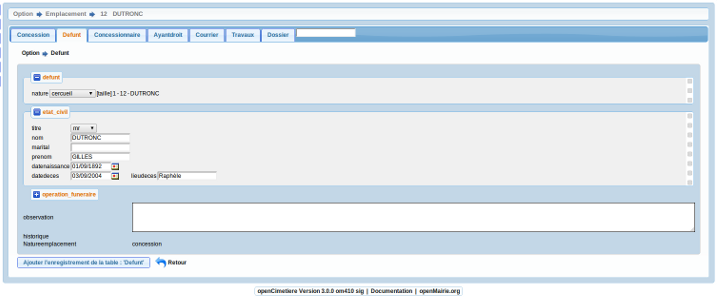

.. _defunt:

################
Saisir un defunt
################

Il est proposé de décrire dans ce paragraphe de decrire la saisie des défunts
dans l'onglet "defunt" de l'emplacement.

Il est possible de creer ou modifier un defunt dans le formulaire ci dessous

Il est saisie :

- le nom du defunt (obligatoire)

- le prénon

- le nom marital

- les dates décès, inhumation, naissance

- le lieu du décès

- les opérations funéraires : exhumation, inhumation

Le calcul de la taille d'occupation est paramétré dans
dyn/var.inc ::

    $taille_cercueil = 1
    $taille_urne = 0,1
    $taille_reduction = 0,5

    $tempsreduction = 5; // 5 annees depuis la date d inhumation
    
C'est sur cette base que se fait le calcul de la taille et la
calcul de place dans emplacement.
(méthode calcultaille de obj/defunt.class.php)

Le paramètrage du formulaire se fait dans dyn/var.inc ::

    $select_titre=array('','Mr','Mme','Melle'); 

