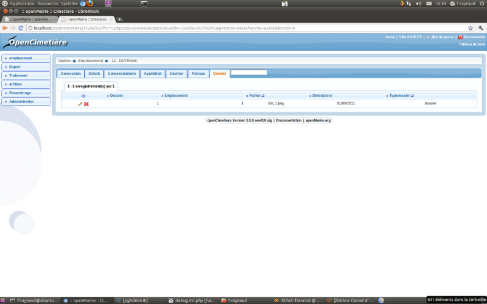
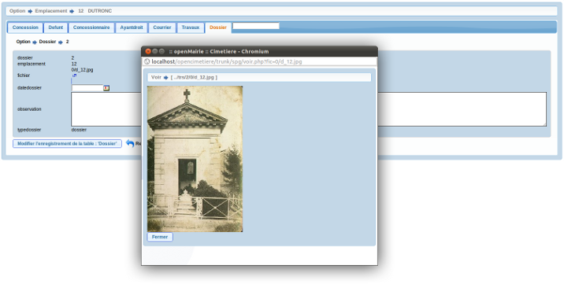

.. _dossier:

##################
Upload de document
##################

Il est proposé de décrire dans ce paragraphe l'upload de document dans les dossiers
dans l'onglet "dossier" de l'emplacement.

Les documents du dossier  sont listés dans l onglet "dossier"

Il est possible de creer ou modifier un dossier dans le formulaire ci dessous

Il est saisie :

- le fichier a uploader (obligatoire)

- la date 

- une observation,

- le type de document: photo ou dossier (pdf)

Les documents sont conservés dans le repertoire trs/numero_de_collectivité

Ils sont codifiés de la manière suivante ::

    p_numeroemplacement.png pour la première photo
    p_numeroemplacement_1.png pour la deuxieme photo
    ...
    
    ou
    
    d_numeroemplacement.pdf pour le premier dossier
    d_numeroemplacement_1.pdf pour le deuxieme dossier
    ...

Le classement se fait dans un repertoire par centaine de dossier si l'option
$dossierparcentaine = 1 (conseillé pour éviter d'avoir des milliers de documents
dans un meme repertoire)

Ce paramètre est en dyn/var.inc

