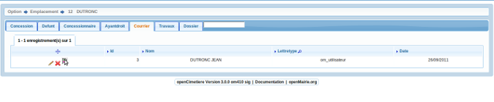
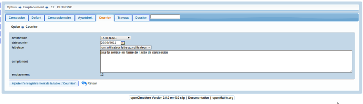

.. _courrier:

##################
Saisir un courrier
##################

Il est proposé de décrire dans ce paragraphe de decrire la saisie des lettres type
dans l'onglet "courrier" de l'emplacement.

Les courriers envoyés sont listés dans l onglet "courrier"

Il est possible de creer ou modifier un courrier dans le formulaire ci dessous

Il est saisie :

- le destinataire (concessionnaire ou ayant droit)

- la date d envoi (par defaut la date du jour)

- la lettre type saisi dans om_lettretype (voir guide openMairie)

- le complement : texte inséré dans la lettre type (suivant le paramétrage zone = {complement]))

Paramètrage dyn/var.inc ::

    $select_voie=array('ALLEE','ILOT','PLACE','PASSAGE','RANGEE','DIVISION');
    $select_zone=array('CARRE','COLLINE','ENCLOS','EXTENSION','SECTION');
    $select_titre=array('','Mr','Mme','Melle');
