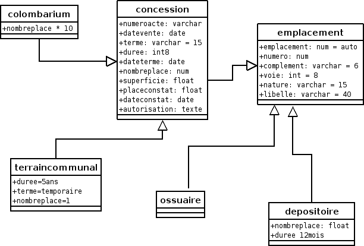
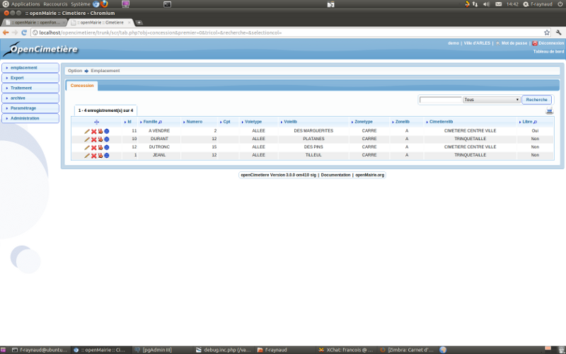
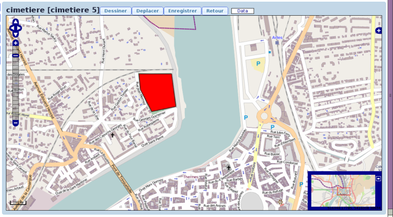
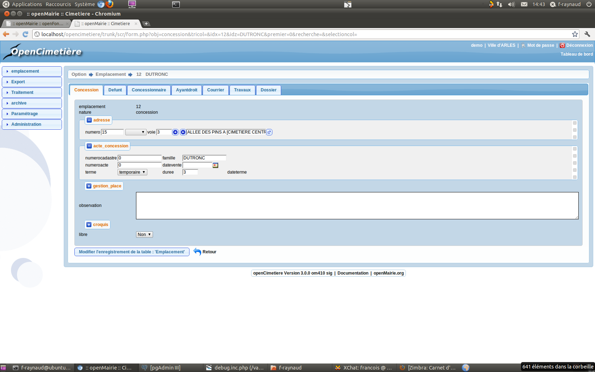

.. _emplacement:

#####################
Saisir un emplacement
#####################

Il est proposé de décrire dans ce paragraphe de decrire la saisie d un emplacement.

Les emplacements sont de nature suivante :

- concession

- colombarium

- enfeu

- terrain communal

- ossuaire

- depositoire

Diagramme de generalisation :

Les emplacements sont listés dans le formulaire suivant

Il est possible de géolocaliser le périmètre du cimetiere :

Il est possible de creer ou modifier ou supprimer un emplacement dans le formulaire ci dessous

Il faut saisir le lieu :

- numero dans la voie

- voie

et la famille.

Le paramètrage suivant du formulaire se fait dans dyn/var.inc ::

    // type de sepulture
    $select_sepulture = array('','fosse maconnee haute',
                          'fosse maconnee  basse',
                          'cavurne',
                          'pierre tombale',
                          'caveau T2 haut',
                          'caveau T2 bas',
                          'caveau T1 haut',
                          'caveau T1 bas',  );
                          
                
    // duree par defaut des terrains communaux
    $duree_defaut_terraincommunal=5;
    $superficie_defaut_terraincommunal=2;

    // version 2.02 SIG
    // croquis actif = 1 non actif =0
    $croquis = 1;
    
    // sig actif =1 non actif =0
    $sig=0; // NON IMPLEMENTE A VOIR ... sig externe
    $siglien="../sig/cimetiere.php";
    
    // *****************************************************************************
    // repertoire des images et dossier par centaine  version 1.11
    // $dossierparcentaine = 1 (conseille) : les dossiers sont classes par centaine
    // exemple la concession 1522 a ses pdf ou jpg en trs/1/15/ ... (si coll=1)
    // $dossierparcentaine = 0 : tous les dossiers (photos, actes ...) sont dans
    // le repertoire trs/1 (si coll=1) compatibilite ascendante
    
    $dossierparcentaine=1;

    // variable photo dans concession : oui = 0 / non = 1
    // compatibilite avec les versions anterieures
    // conseille = 1 et utilisation de dossier pour mettre 1 ou plusieurs photos
    
    $photo_concession=1;

    /**
     * Types de concessions
     * $option_typeconcession => 1 signifie que cette option sera activée
     * $select_typeconcession => 
     /
    
    $select_typeconcession = array ("", "Familiale", "Individuelle", "Collective");
    
    /**
     * Renouvellement de concessions
     * $option_renouvellementconcession => 1 signifie que cette option sera activée
     /

    $option_renouvellementconcession = 1;

    /**
     * SIG externe (Mysql) -> option non diponnible sur pgsql
     *
     /
    // Activer la fonctionnalite lien sig externe
    $option_externesig = 1;
    // Mettre 1 pour utiliser l'id de l'emplacement
    // Mettre 0 pour utiliser l'id renseigne dans le formulaire de la concession (id sig externe)
    $option_utiliseridemplacement = 1;
    // lien (url) du sig
    $lien_externesig = "http://.....IdValue=";

Dans var.inc, il est possible de paramétrer 5 zones supplémentaires ::

    // zones parametrables : concession
    
    $temp1_type = "hidden";// text ou hidden
    $temp1_lib= "zone 1";  // libelle sur le formulaire
    $temp1_taille=10;      // attention la longueur maxi du champs est de 100 varchar
    $temp1_max=10;         // attention la longueur maxi du champs est de 100 varchar
    
    $temp2_type = "hidden";
    $temp2_lib= "zone 2";
    $temp2_taille=20;
    $temp2_max=20; 
    
    $temp3_type = "hidden";
    $temp3_lib= "zone 3";
    $temp3_taille=30;
    $temp3_max=30; 
    
    $temp4_type = "hidden";
    $temp4_lib= "zone 4";
    $temp4_taille=10;
    $temp4_max=10;
    
    $temp5_type = "hidden";
    $temp5_lib= "zone 5";
    $temp5_taille=10;
    $temp5_max=10; 
