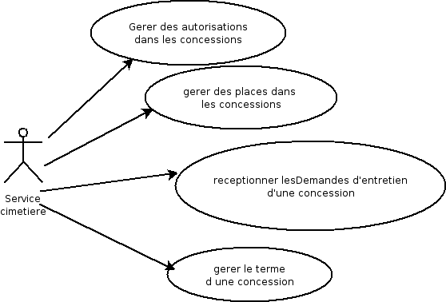
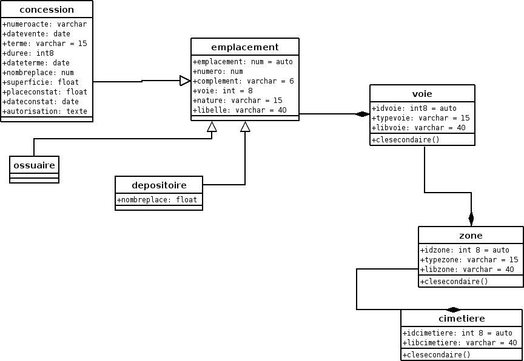

.. _principes:

#############
Les principes
#############

openCimetiere a pour but de gérer l'occupation des cimetieres.

Dans la version 3.0.0, il est traité les concessions, les colombariums, les enfeux, les terrains communaux,
les ossuaires et les dépositoires
.

Les principes sont les suivants :

- la gestion des emplacements et la géolocalisation dans un cimetiere sur fond de carte

- la gestion de la place : les defunts

- la gestion des autorisations (concessionnaires et ayants droits)

- l'édition de lettre type ax concessionnaires et ayant droit

- la gestion des pièces du dossier : arrêtés, notes, photos ...

- la gestion des opérations funéraires

Les évolutions de la version 3.0.0
==================================

La version 3.0.0 utilise openMairie 4.1.0 avec :

- l'ergonomie jquery

- les tableaux de bord individualisable avec widget

- l'information géographique en interne avec openLayers

- le générateur openMairie (depuis la version OM 3.0.0)

Cette version ne fonctionne qu'avec postgresql complété par postgis (pour la partie SIG)
et dblink (pour les vues sur les bases externes)

les fonctions 2.0.0 abandonnées
===============================

openCimetiere n'est pas implémentée pour mysql en version 3.0.0

Il est noté que la version mysql peut être reprise dans une version ultérieure si
des moyens sont mis en oeuvre par des collectivités.

La récupération de données pour postgresql
==========================================

Dans le cadre d'un transfert d'une autre application, il est conseillé d'utiliser
l'option import du menu administrateur (voir guide du développeur openMairie) et de faire
un import en CSV.

Pour un transfert de la version 2.0.0 (mysql) vers la version 3.0.0 (postgresql)
il faut faire une extraction de la base en insérant les data de chaque
table suivant les contraintes d'intégrités ::

    les tables "filles" doivent être importées avant les tables "mères"
        exemple : importer nature avant dossier
        
    les lettres types, état, sous états doivent être importés avec le générateur
        voir guide du développeur openMairie

    Les champs suivants ont été modifiés pourêtre compatible avec le générateur
    
        table entreprise : cle primaire = entreprise
    
        table travaux : cle primaire = travaux et cle secondaire = entreprise

Les cas d'utilisation d'openCimetiere :
=======================================

le Service cimetiere :

Le diagramme de classe openCimetiere
====================================

Le diagramme de classe permet de modéliser les classes et leurs relations
independamment d'un langage de programmation particulier.

Le diagramme des cas d utilisation montre le systeme du point de vue des acteurs.

Le diagramme de classe en montre la structure interne : representation abstraite qui vont
interagir ensemble pour réaliser les cas d utilisation.

    
    
Nous vous proposons maintenant d'utiliser openFoncier :

- de créer et localiser un emplacement

- saisir les défunts

- saisir les autorisations

- saisir les courriers

- télécharger les pièces du dossier de l'emplacement

    
    

