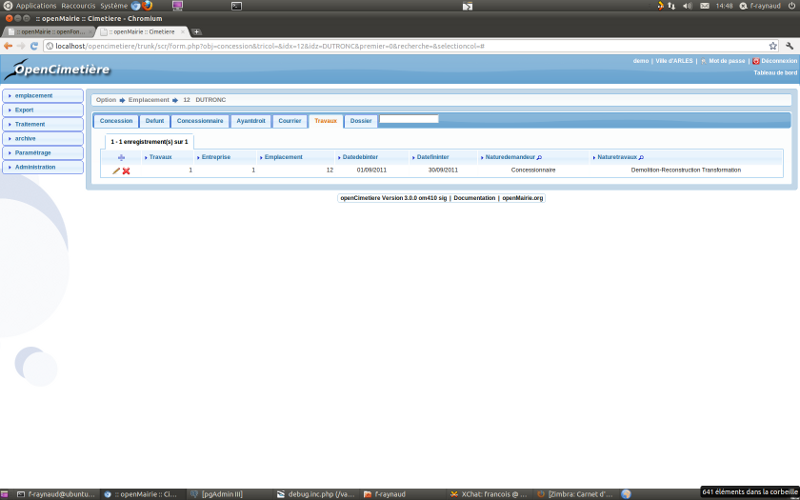

.. _travaux:

##################
Saisir des travaux
##################

Il est proposé de décrire dans ce paragraphe la saisie de travaux dans les dossiers
dans l'onglet "travaux" de l'emplacement.

Les travaux  sont listés dans l onglet "travaux"

Il est possible de creer ou modifier un travaux dans le formulaire ci dessous

.. image:: ../_static/form_travaux.png

Il est saisie :

- entreprise 

- nature de travaux 

La nature de travaux  se paramètre dans dyn/var.inc ::

    $select_travaux = array('','Autorisation de travaux',
                            'Permis de construire',
                            'Autorisation de recouvrement',
                            'Construction caveau T2 haut',
                            'Construction caveau T2 bas',
                            'Construction caveau T1 haut',
                            'Construction caveau T1 bas',
                            'Construction fosse maconnee haute',
                            'Construction fosse maconnee  basse',
                            'Construction d\'un cavurne',
                            'Construction pierre tombale',
                            'Enlevement pierre tombale',
                            'Remise en place pierre tombale',
                            'Enlevement porte',
                            'Remise en place porte',
                            'Demolition-Reconstruction a l\'identique',
                            'Demolition-Reconstruction Transformation',
                            'Creusement',
                            'Surelevation',
                            'Nettoyage-Consolidation',
                            'Pompage eau' );
    